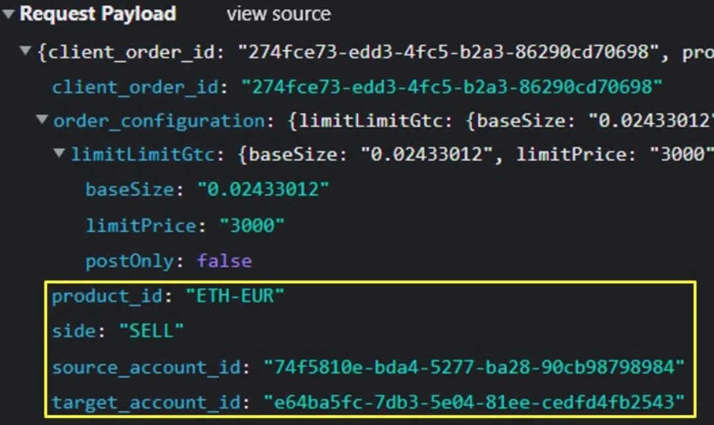

# Anatomy of Real-World API Breaches

### Coinbase

**OWASP Topic:** 
> Broken Object Level Authorization (BOLA)

- Manipulations of parameters via API calls

  

- Sold crypto they DID NOT own
- He effectively overwrote the `source_account_id` to be an account that did not belong to him

### US Postal Service

**OWASP Topic:** 
> Broken Object Level Authorization (BOLA)

- User A able to access User B details (any of 60M accounts)
- See information details from another users without authentication

### Peloton

**OWASP Topic:** 

> Broken Object Level Authorization (BOLA)
> 
> Broken Authentication

- Allowing request user details with NO authentication
- Including accounts marked private

### Venmo

**OWASP Topic:** 

> Broken Authentication
> 
> Broken Object Property Level Authorization
> 
> Unrestricted Resource Consumption

- Unauthenticated requests responding with transaction details from the home page feed

### Instagram

**OWASP Topic:** 

> Broken Authentication
> 
> Broken Object Property Level Authorization

- From the reset password feature
- Submit reset code guesses
- Guesses limited to 200 per IP
- Demonstrated could rotate through 5000 IPs in seconds
- Enables takeover of any account

### Bumble

**OWASP Topic:** 

> Broken Authentication
> 
> Broken Function Level Authorization
> 
> Broken Object Property Level Authorization

- Access to 95M user account details without authentication
- Incremental IDs allowed easy scraping of the entire database
- Allowed inappropriate HTTP methods.
- API allowed paid features to be enabled without proper privileges

### T-Mobile

**OWASP Topic:** 

Broken Authentication

### Optus

**OWASP Topic:** 

> Broken Authentication
> 
> Broken Object Property Level Authorization
> 
> Unrestricted Resource Consumption

- API endpoint required no authentication to access
- The attacker harvested 9.8M user details and threatened $1M ransom
- Data included driver’s license, Medicare IDs, names, phone, email
- They went on the Dark Web and released 10K samples of the data, proving they had legitimate user data, and demanded a million-dollar payment to prevent the full disclosure of all the data

### Experian

**OWASP Topic:** 

> Broken Object Level Authorization
>
> Broken Object Parameter Level Authorization
>
> Improper Inventory Management

- Experian partner site offered loan eligibility feature
- Feature used Experian API for lenders to automate credit score lookup
- Attacker sniffed API calls
- API accessible with no authentication
- Results delivered with name, address, and any value for date of birth