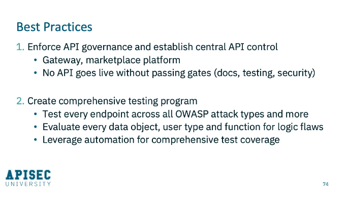
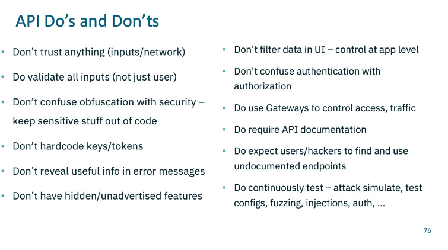

# Conclusion & Best Practices

  

* Testing security;
* For endpoints: Test combinations of every data object, user type, function, and method, and build compreehensive coverage;
  * Only way to achieve this is through automation and continuos testing
  * You want to implement something that will fit into your CI/CD pipeline that will execute all of that test coverage and do so on every release. Although APIs rarely change - i.e., the actual API endpoints themselves - doesn't mean you don't need to test regularly because a vulnerability can creep in through code changes, through infrastructure changes, and those can happen anytime. So continuous testing is crucial here. 
* Create metrics to track how many vulnerabilities are being found, how quickly are they being mitigated;
* Don't trust anything (e.g. inputs, network);
  * Validate all inputs
* Keep sensitive date out of your code;
  * No keys, no tokens, nothing hard-coded
* Don't reveal useful info in error messages
  * If you need to say a user is not authenticated, that's enough. You don't need to say you're expecting an eight digit numerical number. That's info that does not need to be shared back.
* Don't have hidden of unadvertised features
* Don't filter date in the UI:
  * That's not the nob of your UI
  * That's the job of your backend
  * The application itself should control what data is coming out
  * The UI’s job is simply to present, not to enforce or control.
* Don't confuse authentication with authorization. Authentication is about me demonstrating that I'm me. Your application needs to control what I can see and under what circumstances.
* Do use API gateways to control traffic and to really centralize your management
* Do require API documentation
  * Non-optional
  * Not only for internal use, but for security purposes
  * Do expect hackers to find and use those undocumented endpoints.
* Do continuous tests on every release, every push to production, simulate attacks, look at your configs, do injections, do fuzzing, test authentication, test authorization.

  

