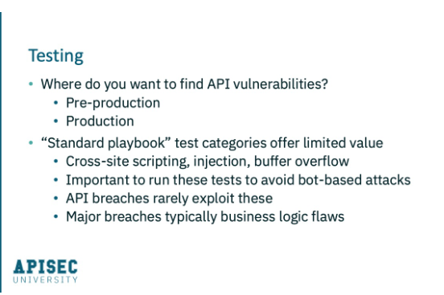
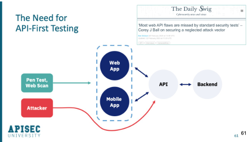
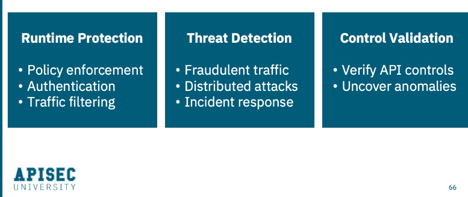
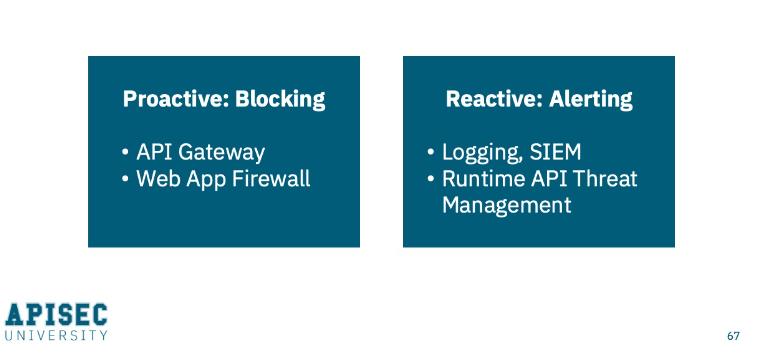
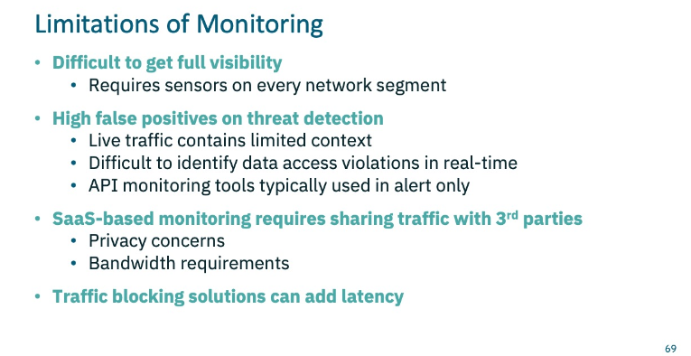

# The 3 Pillars of API Security

  

* **Governance** = Is about defining, establishing and enforcing the processes of developing APIs, testing APIs, and getting them into production in a consistent and secure way.
* **Testing** = is about ensuring that your APIs perform as expected and are free of vulnerabilities or other flaws that can be exploited.
* **Monitoring** = Is about runtime monitoring of those APIs to make sure they're behaving as expected, there aren’t attacks in process that are succeeding or other anomalous behavior on your APIs.

## Governance

  

### Awareness

#### Know Your APIs

* **Get full inventory APIs:**
  * Purpose, owner, documentation
  * What functionality do they offer?
  * Where are they?
  * What is the infrastructure?
  * What is the app architecture?
  * Which containers and virtual machines are related to the API?
  * The databases being connected to the network infrastructure.

* **Standardize and enforce API deployment process:**
   * Only get deployed in approved ways with proper validation according to the context
   * Nothing gets out there without following the process
   * Existence of "shadow/rogue" APIs sign of weak governance
   * Enforce governance at Gateway, Marketplace

* **Mandate API Documentation:**
  * Even with your third party clients and Partners
  * Is critical for testing and validation in Security
  * Make sure APIs are consistent and reusable

* **Create API Development standards:**
  * Create Design Guides for API development so that these APIs get developed
  * Style guides
  * Authentication requirements
  * Versioning
  * PII (Personally Identifiable Information) tracking.

#### Know Your Risks (Threat Modeling)

* **Understand the nature of your APIs (Identify):**
  * What are they?
  * What business flows do they power?
  * What data do they have access to?
  * Who has access to it?
  * Roles and access controls

* **Assess your risk:**
  * What potential threats?
  * What vulnerabilities exist?
  * What logic flaws?
  * What access third parties have?

* **Probability of attack:**
  * Is this data highly sensitive and highly valuable, or is it fairly benign and low value to an attack?
    * **That will help you with your priorization and understanding the impact:**
      * What's the nature of an exploit?
      * What damage?
      * What kind of loss?
      * What consequence can result?

* **Define a response plan (Mitigation):**
  * How are you going to response to an attack when it happens?
  * And how will you address those risks?

#### Documentation: OpenAPI Specification (AKA Swagger)

  

* It doesn't only help integration and enable use of you APIs, but it also aids in security;
* Testing can be built around your API documentation;
* Runtime monitoring can e aided with this documentation;
* You know what you're publishing publicly;
* Make sure you're only publishing what deserves to be out there and that you're retiring old documentation;
* The documentation itself will define everything about your API:
  * The functionality of the endpoints
  * The description
  * Where the API exists
  * The base url
  * All the endpoints
  * The payloads
  * Authentication requirements
  * The input parameters and data types
  * What methods are supported

#### Design Guides: Promote Governance, Consistency

* **Authentication:**
  * How you will authenticate users?
  * What type of authentication?
  * Where you use different types of authentication?

* **Authorization:** 
  * How you controle who has access to what?
    * Where you will enforce that?

* **Naming Conventions:**
   * Tipically you want your URLs to be nouns and Methods to be verbs
   * Whether you're Posting a new record or Putting a new value in or Deleting thing;

* **Error codes:**
  * Should includes status code
  * reference IDs and human readable messages, but make sure those messages aren't revealing useful information back to a potential attacker
    * Don't put in the message what type of data you are expecting 0 Tha's simply informing an attacker how to attack your API

* **Versioning:**
  * When to increment? And when not to

* **Units, Formts, Standards:**
  * Date/time formats, timezone, locales

**Design Guide example**:

  

  

## Testing

  

* The best practice is to make security testing part of your overall testing program;
* It should also be getting tested for security as part of your CI/CD pipeline so that every single release gets evaluated.
* Most of security tests tends to look at things like cross-site scripting, injections, buffer overflow attacks and the like:
  * But most vulnerabilities come from logic flaws in the application itself
  * Make sure that your testing program looks way beyond the standard playbook type of tests

    

* Historically, application testing has focused on the UI layer itself;
  * What attackers are doing is simply going around that, right to the API itself
* The concept of API-First testing is important because the most vulnerabilities found by attackers originate at the API layer (not in UI layer), among which we can mention: Lack of authentication, lack of authorization and expose data in vast quantities.

    

## Monitoring

    

>Understanding how your APIs are performing and operating in productio;

* **Runtime Protection includes:**
  * Policy enforcement;
  * Requiring authentication of users to access endpoints;
  * Filtering traffic: Maybe geographic filter, for example: expecting traffic from a certain region or IP address and so forth.
  
* **Threat Detection:**
  * Look for things like fraudulent transactions;
  * Fraudulent traffic
  * Distribuited attacks coming from lots of different sources that are targeting similar resources;

*  **Incident Response:**
   * You could capture all the traffic, log it all, put it into a repository, and then retrace the steps to understand what happened;
   * And finally then implement the appropriate mitigating controls for future similar attacks.
 
* **Validate Controls:**
  * Make sure that all the controls that you've implemented at the gateway, at the firewall, and in the application itself are functioning as designed (No surprises in production).

### Monitoring Approaches

    

* **Proactive Blocking:**
  * Here's where you can actually enforce policy;
  * You can define in a gateway that certain endpoints are only accessible with valid authentication;
  * Through a firewall you can implement rate limiting or IP whitelisting.

* **Reactive Alerting:**
  * Log monitoring (log management solution);
  * Alerts;
  * Using a SIM (Security information and event management);
  * API threat management tool
  * Understand the traffic through alerts to determine whether it's legitimate traffic or not. From here, refine the alert rules.

    

* **Benefit of monitoring:**
  * Watch what's happening on the wire, on your network, to identify APIs that are in use and active on your network;
  * Useful for generating that inventory and discover APIs that were undiscovered or unknown APIs or unknown endpoints;

    

* **Limitations of Monitoring:**
  * Live traffic has very limited context;
  * The Coinbase example, where user A was trading crypto on behalf of user B. An inline tool will only see an HTTP request that identifies a source account, a destination account and some other transaction details;
    * That's why we implement Authorization at the application logic level.
  * In many cases, many API monitoring technologies may require sharing your traffic data with third parties. That may be a violation of privacy and can cause bandwidth concerns or even latency.