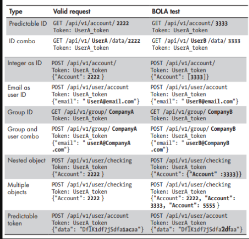

# API1:2023 Broken Object Level Authorization

[Details in Fundamentals](https://github.com/Leonardofreua/certs/blob/main/APISEC_University/API_Security_Fundamentals/OWASP_API_security_top_10.md#1-broken-object-level-authorization-bola)

## Summary

* Does not have sufficient access controls;
* Does not perform checks to make sure users can only access their own resources;
* User A will be able to obtain User B’s resources via API requests;

For instance, magine that an authenticated user, Bruce, sends a GET request to https://herohospital.com/api/v3/users?id=2727 and receives the following response:

```json
{
    "id": "2727",
    "fname": "Bruce",
    "lname": "Wayne",
    "dob": "1975-02-19",
    "username": "bman",
    "diagnosis": "Depression"
}
```

No problem; Bruce should be able to access Bruce's own information. However, if Bruce is able to access another user’s information then a BOLA vulnerability would be present.

Say Bruce is able to obtain information about another user by sending a request for https://herohospital.com/api/v3/users?id=2728 and receives the following response:

```json
{
    "id": "2728",
    "fname": "Harvey",
    "lname": "Dent",
    "dob": "1979-03-30",
    "username": "twoface",
    "diagnosis": "Dissociative Identity Disorder"
}
```

Assuming that Bruce is still using his authorization to access this data, this would be a clear indication that the API is vulnerable to BOLA. 

BOLA isn't always as simple as this example because there is flexibility in how resources are provisioned and requested from one API to the next.

The bold resource IDs in the following API requests should catch your attention:

* GET /api/user/**1**
* GET /user/account/find?user_id=**aE1230000token**
* POST /company/account/**Apple**/balance
* GET /admin/settings/account/**bman**

In these instances, you can probably guess other potential resources, like the following, by altering the bold values:

* GET /api/resource/**3**
* GET /user/account/find?user_id=**23**
* POST /company/account/**Google**/balance
* POST /admin/settings/account/**hdent**

More Examples:

<p align="center">
    
</p>