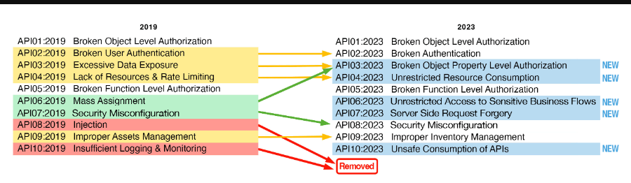
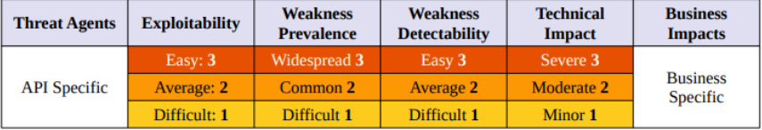
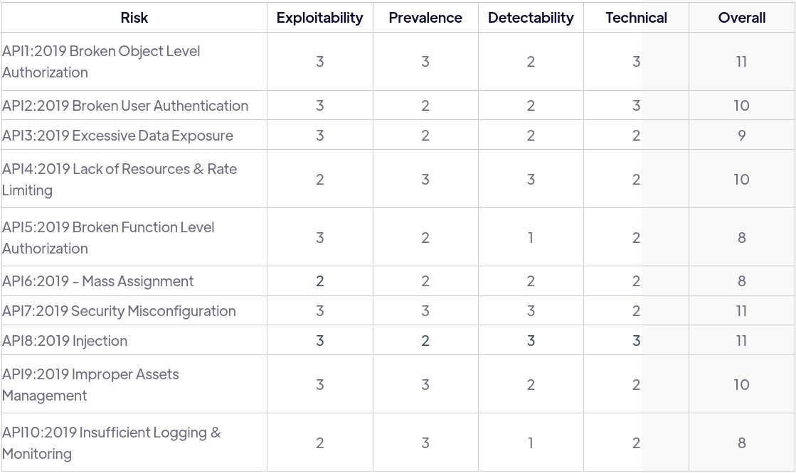
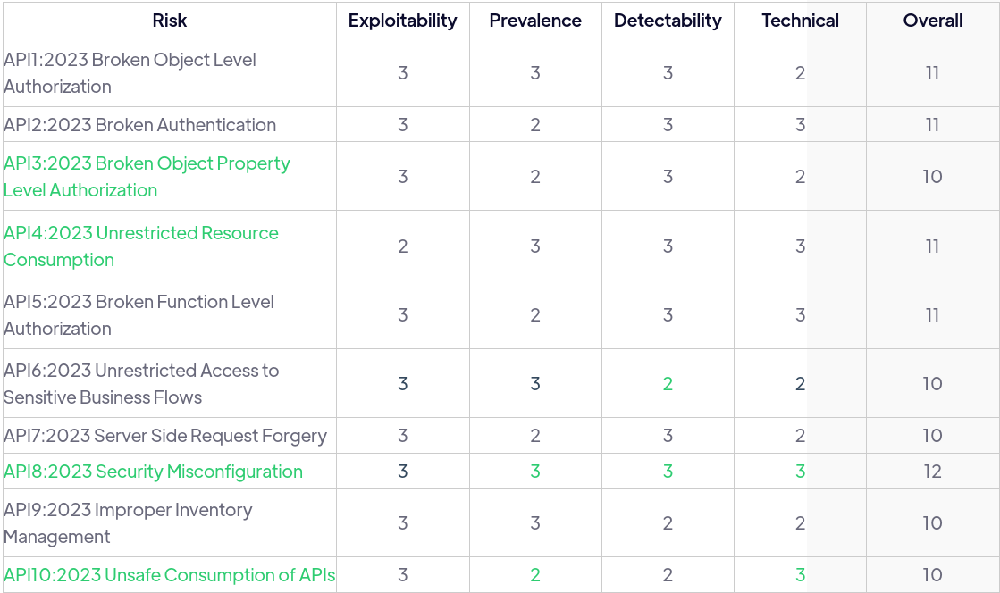

# What is OWASP API Security Top 10?

The OWASP API Security Top 10 was originally released in Decemeber 2019 and was driven by several key factors:

1. The Rapid Rise of APIs

* A business no longe needs to specialize in all aspects of creating software, instead, they can use the features of software shared by other companies;
* It doesn't matter what programming languages is used in the application, since communications is done through universal protocols;
* Coupling new features is much faster.

2. A Mahor Gap in Security

* The tools and techniques that were used for enterprise vulnerability management programs, web application scanners, and traditional network security monitoring tools were not designed to handle the unique challenges posed by APIs. 

3. A New Leading Attack Vector

* Often, when it comes to the rapid adoption of new technologies, security is an afterthought;
* The rapid adoption of APIs led to a new attack vector that exposes data application functionality;
* Public, Internet-facing, APIs often bypassed all of the security measures that had grown with business over the past decade;
* An attacker no longer needs to go through the classic MITRE cyber kill chain (bypass the firewall, gain entry to the network, pivot to a system containing data, and then exfiltrate that data). Instead, an attacker can use an insecure API and have direct access to sensitive data.

## How is the Top 10 Compiled?

An attacker no longer needs to go through the classic MITRE cyber kill chain (bypass the firewall, gain entry to the network, pivot to a system containing data, and then exfiltrate that data). Instead, an attacker can use an insecure API and have direct access to sensitive data.

* Bug bounty programs incentivize certain types of findings over others
* Bug bounty programs attract participant that represents a small sample of the APIs out in the wild
* Newsworthy incidents often leave security researchers without specific technical details
* Obviously, newsworthy incidents do not include all of the breaches and security incidents that are not reported or publicized

List of bug bounty writeups:
* [PentesterLand Writeups Compilation](https://pentester.land/writeups/)
* [HackerOne Hacktivity](https://hackerone.com/hacktivity) 
* [Awesome Bugbounty Writeups](https://github.com/devanshbatham/Awesome-Bugbounty-Writeups) 

## Mapped to External Sources

The OWASP API Security risks are associated with references to external sources. These sources include Common Weakness Enumeration (CWE), other OWASP projects, and National Institute of Standards and Technology (NIST) guidance. Most of the references involve CWEs. CWEs are a list of common software and hardware vulnerabilities developed by the community and hosted by MITRE. Each CWE is identified by a unique identifier or CWE-ID. This identifier can be used to refer back to a specific vulnerability.

 
| OWASP Top 10                                              | External Reference                                                                          |
| --------------------------------------------------------- | ------------------------------------------------------------------------------------------- |                                 
| API1:2023 Broken Object Level Authorization               | * CWE-285: Improper Authorization                                                           |
|                                                           | * CWE-639: Authorization Bypass Through User-Controlled Key                                 |
|                                                           |                                                                                             |
| API2:2023 Broken Authentication                           | * CWE-204: Observable Response Discrepancy                                                  |
|                                                           | * CWE-307: Improper Restriction of Excessive Authentication Attempts                        |
|                                                           |                                                                                             |
| API3:2023 Broken Object Property Level Authorization      | * CWE-213: Exposure of Sensitive Information Due to Incompatible Policies                   |
|                                                           | * CWE-915: Improperly Controlled Modification of Dynamically-Determined Object Attributes   |
|                                                           | * API3:2019 Excessive Data Exposure - OWASP API Security Top 10 2019                        |
|                                                           | * API6:2019 - Mass Assignment - OWASP API Security Top 10 2019                              |           
|                                                           |                                                                                             |
| API4:2023 Unrestricted Resource Consumption               | * CWE-770: Allocation of Resources Without Limits or Throttling                             |
|                                                           | * CWE-400: Uncontrolled Resource Consumption                                                |
|                                                           | * CWE-799: Improper Control of Interaction Frequency                                        |
|                                                           | * NIST Security Strategies for Microservices-based Application                              |  
|                                                           |                                                                                             |
| API5:2023 Broken Function Level Authorization             | * CWE-285: Improper Authorization                                                           |
|                                                           | * OWASP Top 10 2013: A7: Missing Function Level Access Control                              |
|                                                           | * OWASP Guidance: Forced Browsing                                                           |
|                                                           | * OWASP Guidance: Access Control                                                            |  
|                                                           |                                                                                             |
| API6:2023 Unrestricted Access to Sensitive Business Flows | * API10:2019 Insufficient Logging & Monitoring                                              |
|                                                           | * OWASP Automated Threats to Web Applications                                               |
|                                                           |                                                                                             |  
| API6:2023 Server Side Request Forgery                     | * CWE-918: Server-Side Request Forgery (SSRF)                                               |
|                                                           | * URL confusion vulnerabilities in the wild: Exploring parser inconsistencies, Snyk         |
|                                                           | * Server Side Request Forgery                                                               |
|                                                           | * Server-Side Request Forgery Prevention Cheat Sheet                                        |  
|                                                           |                                                                                             |
| API8:2023 Security Misconfiguration                       | * CWE-2: Environmental Security Flaws                                                       |    
|                                                           | * CWE-16: Configuration                                                                     |             
|                                                           | * CWE-209: Generation of Error Message Containing Sensitive Information                     |
|                                                           | * CWE-319: Cleartext Transmission of Sensitive Information                                  |
|                                                           | * CWE-388: Error Handling                                                                   |
|                                                           | * CWE-444: Inconsistent Interpretation of HTTP Requests ('HTTP Request/Response Smuggling') |
|                                                           | * CWE-942: Permissive Cross-domain Policy with Untrusted Domains                            |
|                                                           | * NIST Guide to General Server Security                                                     |
|                                                           | * Let's Encrypt: a free, automated, and open Certificate Authority                          |
|                                                           | * OWASP Secure Headers Project                                                              |
|                                                           | * Configuration and Deployment Management Testing - Web Security Testing Guide              |
|                                                           | * Testing for Error Handling - Web Security                                                 |  
|                                                           |                                                                                             |
| API9:2023 Improper Inventory Management                   | * CWE-1059: Incomplete Documentation                                                        |
|                                                           |                                                                                             |  
| API10:2023 Unsafe Consumption of APIs                     | * CWE-285: Improper Authorization                                                           |
|                                                           | * CWE-639: Authorization Bypass Through User-Controlled                                     |  

# Updates to the API Security Top 10

* Since the release of the OWASP API Security Top 10, in 2019, API usage has grown, API-related data breaches have continued, and new API technologies have emerged. 
* API attacks are consistently on the rise;
* Akamai reported seeing nearly 114 million API attacks in a single day in 2021;
* The global API market value was valued at $2.2 billion in 2021 and was predicted to reach $41.5 billion by 2031 (20x times growth in 10 years);
* Postman had over 46 million Postman collections and Github had 3 million API-related repos;
  

    

At a high level when you compare the Top 10 from 2019 to 2023, you see:

* Two previous risks were removed from the list;
* Three remained exactly the same;
* Four were updated;
* Five of 2023 are new.

## Two Removed

* The two items that were removed included:
  *  Injection;
  *  and Insufficient Logging and Monitoring.
* These two risks were not completely mitigated and resolved, but the importance of new emerging risks pushed them beyond the top 10;
* Injection attacks are still around and many web APIs are still susceptible, but the adoption of web application firewalls and implementation of other mitigation techniques has reduced the occurrence of notable API injection attacks.

## Three Remain

* There were three categories that remained on the list:
  *  Broken Object Level Authorization (BOLA);
  *  Broken Function Level Authorization (BFLA);
  *  and Security Misconfiguration.
* APIs continue to have severe issues when it comes to authorization risk;
* The Security Misconfiguration category contains a wide range of possible misconfigurations that can plague APIs;
*  In other words, this category is unlikely to leave the top 10 because it is a catch-all for many API vulnerabilities. 

## Four Renamed

*  The renaming of these categories helped simplify the risk categories and bring additional focus to the issue at hand:
   *  Broken User Authentication has now become Broken Authentication;
      *  This simplification has done away with "User" and now brings additional attention to API authentication as a whole process.
   *  Improper Assets Management has become Improper Inventory Management
      *  This change was likely made to better align with industry terminology and to cover a wider range of resources.
      *  The term "assets" might only refer to tangible items valued by an organization, while the term "inventory" could refer to a wider set of resources.

## Five are New

* Server Side Request Forgery and Unsafe Consumption of APIs are completely new and did not have previous representation on the 2019 OWASP API Security Top 10 list;
* Server Side Request Forgery (SSRF) was represented on the 2021 OWASP Top 10 and was added to that list based on survey results rather than by incident occurrence;
* The remaining new risk categories include Broken Object Property Level Authorization, Unrestricted Resource Consumption, and Unrestricted Access to Sensitive Business Flows each contains elements from the 2019 list:
  * For example: BOPLA ais a combination of Excessive Data Exposure and Mass assignment

## Risk Rating

> [API Security Risks](https://owasp.org/API-Security/editions/2023/en/0x10-api-security-risks/)

    

* This rating does not take into account the actual impact on a specific business;
* The risk score must be determined by the given organization;
* The purpose of OWASP API Security Top 10 was not to perform a specific risk analysis for a given organization, but to provide a guideline for organizations to consider risk factors.

### 2019 Risk Scores

    

### 2023 Risk Scores

    

