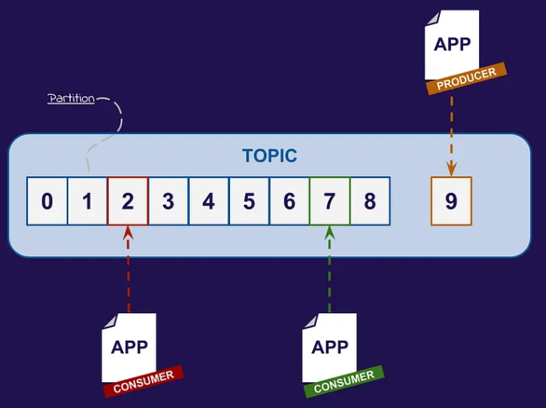
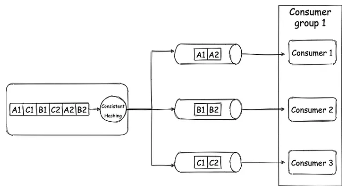

# Asynchronism

  

* Reduce request times for expensive operations that would otherwise be performed in-line;
* Also help by doing time-consuming work in advance, such as periodic aggregation of data.

## Kafka

> Is a Distributed Streaming Platform or a Distributed Commit Log

**Distributed**:
* Works as a cluster of one or more nodes that can live in different Datacenters
* It's inherently scalable, available, and fault-tolerant

**Streaming Platform:**
* Stores data as a stream of continuous records which can be processed in different methods.

**Commit Log:**
* When you push data to Kafka it takes and appends them to a stream of records, like appending logs in a log file or if you’re from a Database background like the [WAL (Write-ahead logging)](https://en.wikipedia.org/wiki/Write-ahead_logging)
* This stream of data can be Replayed or read from any point in time

### Message/Event

* Is the atomic unit of data for Kafka
* Might have an associate "Key" which is nothing but some metadata
  * Is used to determine the destination partition for message
* Events are immutable. It's impossible to change the past

### Offset

**What is?**
* Each message in a partition is given a unique sequential number called Offset
* Is essentially an identifier that marks the position of a message within a partition
* It's immutable and ever-increasing

**How does it work?** 
* A message receives a offset when it's produced
* Consumers in turn, uses the offsets to read the messages from partitions
* Each consumer keeps track of the last offset read in each partition, allowing it to know where to continue reading the next time he goes to retrieve messages

**Control Flow:**
* Offset allows consumers to read messages at their own pace
* They can pause, resume, or restart reading from a specific offset, providing precise controle over the data flow

**Failure Recovery:**
* Consumers can restart reading from last confirmed offset, ensuing that no messages are lost
* This is especially important for distributed systems, where failures can occur at any time

** Parallel processing:**
* Each partition has its own offsets, multiples consumers can process messages in parallel, increasing the efficiency and scalability of the system

### Topic

  

* A topic is a log of events.
* Apache Kafka’s most fundamental unit of organization is the topic, which is something like a table in a relational database.
* You create different topics to hold different kinds of events and different topics to hold filtered and transformed versions of the same kind of event.
* Every event is appended to the end of your topic
* They aren't deleted from topic until a configurable amount of time has elapsed, even if they've been read;
* Topics are properly logs, NOT QUEUES; they are durable, replicated, fault-tolerant records of the events stored in them.
* Topics are stored as log files on disk

### Partitions

* Systematic way of breaking the one topic log file into many logs, each of which can be hosted on a separed server;
* Partition is analogous to shard in the database and is the core concept behind Kafka's scaling capabilities.

Scenario:

* Our system becomes really popular and hence there are millions of log messages per seconds;
* So now, the node on which appLogs topic is present, is unable to hold all the data that is coming in;
* We initially solve this by adding more storage to our node i.e vertical scaling;
  * But as we all know vertical scaling has its limit
* Which means we need to add more nodes and split the data between the nodes
  * When we split data of a topic into multiple stream, we call all of those streams the "Partition" of the topic

  

* The blocks avobe are the different messages in that partition
* Imagine the topic to be an array, now due to memory constraint we have split the single array into 4 different smaller array;
* The numbers on the blocks in this picture denote the **Offset** the first block is at the 0th offset and the last block would on the (n-1)th offset;
* Please note that on Kafka it is not going to be an actual array but a symbolic one

### Producer

* Is an external application that writes messages to a Kafka cluster, communicating with the cluster using Kafka's network protocol;
* Is responsability of the Producer to diced which partition to send the messages to. Let's take a look at the producer configuration criteria:
  * **No Key specified:** When no key is specified in the message, the producer will randomly decide partition and would try to balance the total number of messages on all partitions
  * **Key Specified:** When a key is specified, then the producer uses [Consistent Hashing](https://www.toptal.com/big-data/consistent-hashing) to map the key to a partition
    * Consistent Hashing is a mechanism where for the same key same hash is generated always, and it minimizes the redistribution of keys on a re-hashing scenario like a node add or a node removal tot he cluster.
  * **Partition Specified:** You can hardcode the destination partition as well.
  * **Custom Partitioning logic:** We can write some rules depending on which the partition can be decided.

### Consumer

* Read messages from partitions in the same order they were produced in the topic;
* Since every message has an offset, every time a consumer reads a message it stores the offset value onto Kafka or Zookeeper, denoting that it's the last message that the consumer read
* SO in case, a consumer node goes down, it can come back and resume from the last read position
* Also if at any point in time a consumer needs to go back in time and read older message, it can do so by just restting the offset position

### Consumer Group

Collection of consumers that work together to read messages from a topic.

1. **Fan out exchange:**
> A single topic can be subscribed to by multple consumer groups

Example:
- You need to send content via E-mail and SMS
- OTP service put the content in OTP Topic
- And then, the SMS Service consumer group and Email service consumer group can both receive the message and can then send the content out

    

2. **Order guarantee:**

One partition can not be read by multiple consumers in the same consumer group. This is enabled by the consumer group only, only one consumer in the group gets to read from a single partition.

Example:
- Your producer produces 6 messages
- Each message is a key-value pair, for key "A" value is "1", for "C" value is "1", and so on.
- Our topic has 3 partitions, and due to consistent hashing messages with the same key always go to the same partition, so all the messages with "A" as the key will get grouped and the same for B and C.
- Each partition has only one consumer, so they get message in order only
  - **The consumer will receive A1 before A2 and B1 before B2, and thus the order is maintained!!**
- All the logs for node1 will go to the same partition always. And since the messages are always going to the same partition, we will have the order of the messages maintained.
- This won't be possible if the same partition had multiple consumers in the same group
- If you **read the same partition in the different consumers**, who are in different groups, then also for each consumer group the messages will end up **ordered**.

    

* For 3 partitions, you can have a max of 3 consumers, if you had 4 consumers, one consumer will be sitting idle.
* But for 3 partitions you can have 2 consumers, then one consumer will read from one partition and one consumer will read from two partitions
* If one consumer goes down in this case, the last surviving consumer will end up reading from all the three partitions, and when new consumers are added back, again partition would be split between consumers. **This is called re-balancing**.

    

### Broker

> Is a single Kafka server

* Receive messages from producers
* Assign offset to messages
* Commit messages to the partition log
  * Write data to disk

### Cluster

> Group of broker nodes working together to provide scalability, availability, and fault tolerance.

* One of the brokers in a cluster works as the Controller, which basically assigns partitions to brokers, monitors for broker failure to do certain administrative stuff
* Partitions are replicated on multiple brokers depending on the replication factor of the topic to have **failover** capability. Example:
  * For a topic of replication factor 3
  * Each partition of that topic will live onto 3 different brokers
  * When a partition is replicated onto 3 brokers, one of the brokers will act as the leader for that partition and the rest two will be followers
  * Data is always written on the leader borker and then replicated to the followers
  * This way we don't lose data nor availability of the cluster, and if the leader goes down another leader is elected
