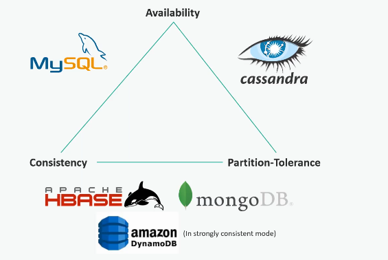
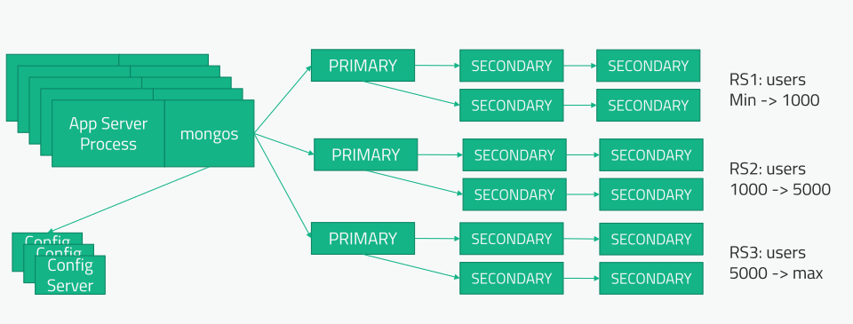
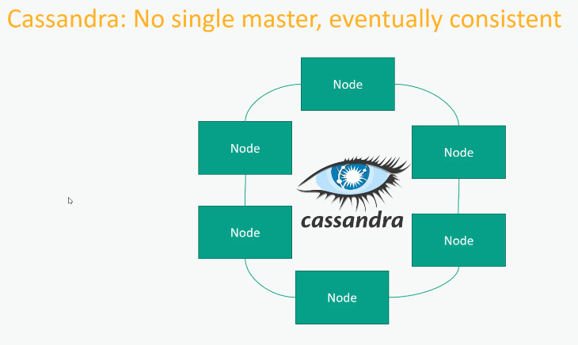

# CAP Theorem

  

- Consistency: I get back what I just wrote immediately
- Availability: Single point of failure that can fail
- Partition-Tolerance: Scale the system horizontally with ease

## MongoDB: Single master; trades of availability

  

- We have a configuration server, which is the main one, and we have an application server, which is the main one at any given time;
- Even though we have multiple backups waiting to run, there will be a brief period of downtime if any of these servers go down
  - What happens is that the system first has to detect that there has been an outage, 
    and then the remaining servers have to elect a new primary host to take its place. And this can take a few seconds
- We're giving up Availability (A) because we only have one point of failure;
- We still have Consistency (C), because our data is still being written to the replicas
- Of course, MongoDB is quite tolerant to Partitioning (P) and these partitions can be individually scalable

## Cassandra: No single master, eventually consistent

  

- We're giving up Consistency (C)
- There isn't a single master in Cassandra. So, we have to trade off the Consistency (C) as it may take some time for data to replicate to whatever node that data is being backed up to.
