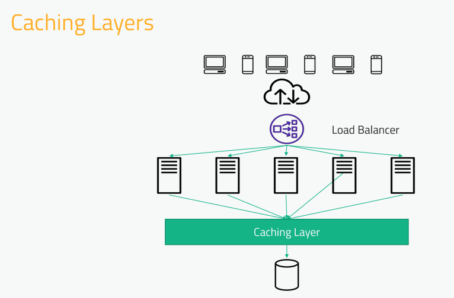
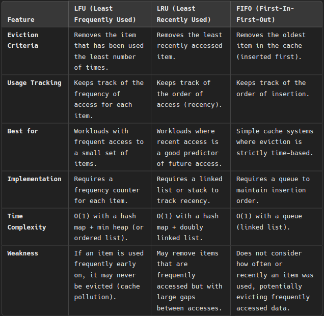
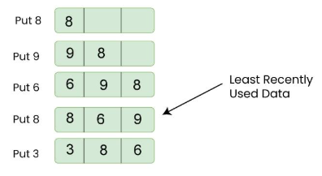
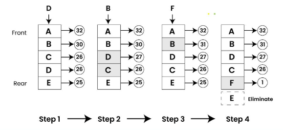
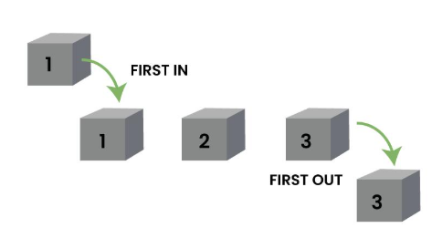
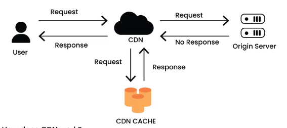

# Cache

<p align="center">
  
</p>

- Our Caching layer could be a set of other servers that sit alongside your application servers, whose sole function is to maintain in-memory copies of that data that's going into that database;
- One advantage is that we can resize this cache pool independently of the application pool;
- In case of distributed cache, the consistent hashing function will be used to route the request to where the data will be stored;
- Appropiate for applications with more **reads** than **writes**;
- The *expiration policy* dictates how long data is cached. Too long and your data may go stale; too short and the cache won't do much good;
- *Hotspots* can be a problem (the "celebrity problem"):
  - A cache hotspot identifies instructions that are accessed frequently.
  - It stores these instructions in the L0 cache.
  - Other instructions are stored in the L1 cache.
- Cold-start is also a problem. How do you initially warm up the cache without bringing down whatever your are caching?
  - Let's say that our cache layer goes offline and we have to restart it. All traffic will be redirected to the database. So it will take some time for the cache to warm up;
  - One way to deal with this is to have a separate procedure to warm up the cache before actually exposing it to the outside world
  - So maybe you have a process to actually artificially send traffic to the cache layer for simulated requests;
  - You might be playing back the dealys from the previous day or something;
  - And don't turn the system back on so that the cache layer is not powered until you are sure that it has been properly warmed up.

## Eviction Polices



* **LFU** is best when: Some items are accessed much more frequently than others.
* **LRU** is best when: Recent access is a good indicator of future access.
* **FIFO** is best when: Simplicity is needed, and cache lifespan is time-based.

### Least Recently Used (LRU)

> [Source code](https://github.com/Leonardofreua/study/blob/main/Algorithms/cache/lru.go)

<p align="center">
  
</p>

- A double linked list is used for to contains the accessed elements:
  - In this structure each node contains two pointers, one to the next node and one to the previous node;
  - The list is sorted according to the order in which the data was accessed, with the most recently used node at the beginning (head) of the list and the least recently used node at the end (tail);
  - When a piece of data is accessed, it is moved to the beginning of the list, indicating that it was the most recently used
  - If the cache is full and new data needs to be stored, the LRU removes the last node that reprensents the last used data.

<p align="center">
  
</p>

### Least Frequently Used (LFU)

<p align="center">
  
</p>

> Consider a cache with items X, Y, and Z. If item Z has been accessed fewer times than items X and Y, the LFU policy will retain the items X and Y and potentially evict item Z when the cache reaches its capacity.

### First-In-First-Out (FIFO)

<p align="center">
  
</p>

- Data is stored in the cache in the order it arrives
- The item that has been present in the cache for the longest time is the first to be evicted when the cache reaches its capacity;

Example:

```
Imagine a cache with a capacity of three items:

A is added to the cache.
B is added to the cache.
C is added to the cache.
At this point, the cache is full (capacity = 3)
```

If a new item, D, needs to be added, the FIFO policy would dictate that the oldest item, A, should be evicted. The cache would then look like:

- D is added to the cache (A is evicted).
- The order of items in the cache now is B, C, and D, reflecting the chronological order of their arrival.

# Content Delivery Network (CDN)
> Is a distributed network of servers that work together to deliver content (like images, videos, and static files).

- These servers, called as edge servers, which are strategically positioned across various geographical locations
- Help improve the performance, reliability, and scalability of websites and web applications by caching content closer to users, reducing latency, and offloading traffic from origin servers.
- **Faaster content delivery**: Improve load times and lower latency by reducing the physical distance that data must travel by caching content
- **Scalability:** Help websites handle traffic spikes and high loeads by distributing the load across multiple servers. Essential for websites with global audience.
- **Redundancy and Reliability:** Offer redundancy by storing copies of content across multiple servers. If one server fails, another server can seamlessly take over, ensuring continuous availability of the content.
- **Security:** Provide addtional security features, such as DDos protection, SSL/TLS encryption, and web application firewalls.

<p align="center">
  
</p>

## Types

### Public
> These CDNs are used to swiftly and effectively provide content, including pictures, movies, and other static files, to users.

- Cloudflre
- Akamai
- Amazon CloudFront

### Private
> These CDNs are used to distribute content to internal users or clients, and they are frequently set up on a private cloud or within an organization's own infrastructure

- Google Cloud CDN
- Netflix Open Connect

### Hybrid
> Combine elements of both public and private. This approach allows organizations to optimize content delivery based on factors such as cost, performance, and security requirements.

- Microsoft Azure CDN

References:
- [Caching](https://www.geeksforgeeks.org/caching-system-design-concept-for-beginners/#5-types-of-cache)
- [How to Implement LRU Cache in Java](https://www.baeldung.com/java-lru-cache)
- [Cache Eviction Policies](https://www.geeksforgeeks.org/cache-eviction-policies-system-design/#1-least-recently-usedlru)
- [What is Content Delivery Network(CDN) in System Design](https://www.geeksforgeeks.org/what-is-content-delivery-networkcdn-in-system-design/)