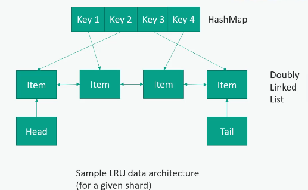

# Cache

  

- Our Caching layer could be a set of other servers that sit alongside your application servers, whose sole function is to maintain in-memory copies of that data that's going into that database;
- One advantage is that we can resize this cache pool independently of the application pool;
- In case of distributed cache, the consistent hashing function will be used to route the request to where the data will be stored;
- Appropiate for applications with more **reads** than **writes**;
- The *expiration policy* dictates how long data is cached. Too long and your data may go stale; too short and the cache won't do much good;
- *Hotspots* can be a problem (the "celebrity problem"):
  - A cache hotspot identifies instructions that are accessed frequently.
  - It stores these instructions in the L0 cache.
  - Other instructions are stored in the L1 cache.
- Cold-start is also a problem. How do you initially warm up the cache without bringing down whatever your are caching?
  - Let's say that our cache layer goes offline and we have to restart it. All traffic will be redirected to the database. So it will take some time for the cache to warm up;
  - One way to deal with this is to have a separate procedure to warm up the cache before actually exposing it to the outside world
  - So maybe you have a process to actually artificially send traffic to the cache layer for simulated requests;
  - You might be playing back the dealys from the previous day or something;
  - And don't turn the system back on so that the cache layer is not powered until you are sure that it has been properly warmed up.

## Eviction Polices

### Least Recently Used (LRU)

  

- A double linked list is used for to contains the accessed elements:
  - In this structure each node contains two pointers, one to the next node and one to the previous node;
  - The list is sorted according to the order in which the data was accessed, with the most recently used node at the beginning (head) of the list and the least recently used node at the end (tail);
  - When a piece of data is accessed, it is moved to the beginning of the list, indicating that it was the most recently used
  - If the cache is full and new data needs to be stored, the LRU removes the last node that reprensents the last used data.

  

### Least Frequently Used (LFU)

  

> Consider a cache with items X, Y, and Z. If item Z has been accessed fewer times than items X and Y, the LFU policy will retain the items X and Y and potentially evict item Z when the cache reaches its capacity.

References:
- [Caching](https://www.geeksforgeeks.org/caching-system-design-concept-for-beginners/#5-types-of-cache)
- [How to Implement LRU Cache in Java](https://www.baeldung.com/java-lru-cache)
- [Cache Eviction Policies](https://www.geeksforgeeks.org/cache-eviction-policies-system-design/#1-least-recently-usedlru)